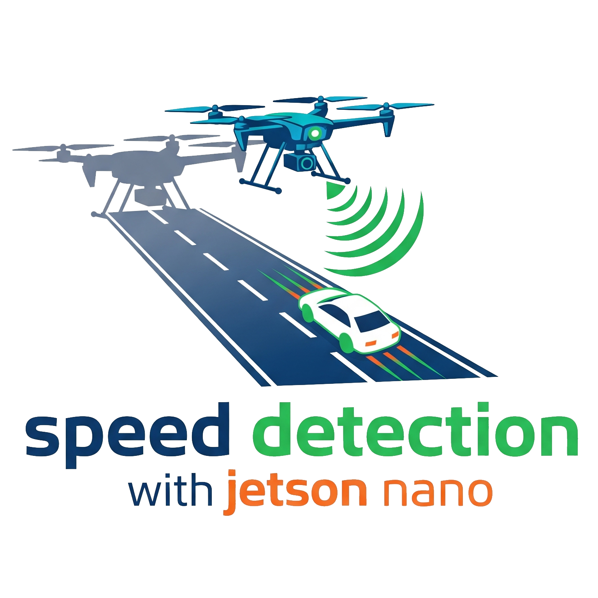

<div align="center">
<h1>🚁  FINAL PROJECT - VEHICLE SPEED ESTIMATION SYSTEM USING YOLOv8 BASED ON DRONE VIDEO ON JETSON NANO</h1>
<a href="https://github.com/still-breath/speed-detection_drone_jetson-nano.git/header.png">
    
</a>
</div>

<p align="center">
<a target="_blank" href="https://www.linkedin.com/in/syahrulahmad/"></a>
<a target="_blank" href="https://github.com/still-breath/speed-detection_drone_jetson-nano.git"></a>
<a target="_blank" href="https://github.com/still-breath/speed-detection_drone_jetson-nano"></a>
<a target="_blank" href="https://github.com/still-breath/speed-detection_drone_jetson-nano"></a>
</p>

<p align="center">
<a href="#-introduction">Introduction</a> &nbsp;&bull;&nbsp;
<a href="#-tech-stack">Tech Stack</a> &nbsp;&bull;&nbsp;
<a href="#-installation--usage">Installation & Usage</a> &nbsp;&bull;&nbsp;
<a href="#-mediamtx-rtmp-server-setup">MediaMTX RTMP Server</a> &nbsp;&bull;&nbsp;
<a href="#-demo">Demo</a> &nbsp;&bull;&nbsp;
<a href="#-issue">Issue</a>&nbsp;&bull;&nbsp;
<a href="#-license">License</a>&nbsp;&bull;&nbsp;
<a href="#-author">Author</a>
</p>

---

## 📄 Introduction

This project is a **real-time vehicle speed estimation system** designed to run on an **NVIDIA Jetson Nano** using a drone as a mobile surveillance platform. The system combines **YOLOv8** for object detection and **OC-SORT** for tracking to provide accurate speed measurements from aerial footage.

### 🎯 Key Features
- **Real-time Performance**: Optimized with TensorRT (FP16) achieving **3x faster** inference speeds (10-15 FPS)
- **Dual-Condition Models**: Specialized models for both day and night conditions
- **High Accuracy**: Nighttime model achieves superior **mAP50 of 0.93**
- **Drone Integration**: Designed for mobile aerial surveillance platforms
- **RTMP Streaming**: Real-time video streaming from drone to ground station

This project was created to fulfill the **Undergraduate Thesis Research** at the Computer Engineering Department, **Sepuluh Nopember Institute of Technology**.

---

## 💻 Tech Stack

Frameworks, Libraries, and Tools used in this project:

<p align="center">
<a target="_blank" href="https://docs.ultralytics.com/">

</a>
<a target="_blank" href="https://opencv.org/">

</a>
<a target="_blank" href="https://developer.nvidia.com/tensorrt">

</a>
</p>

<p align="center">
<a target="_blank" href="https://developer.nvidia.com/embedded/jetpack">

</a>
<a target="_blank" href="https://github.com/mikel-brostrom/yolov8_tracking">

</a>
<a target="_blank" href="https://github.com/bluenviron/mediamtx">

</a>
</p>

---

## 🖼️ Preview

<div align="center">

</div>

### 🎥 Sample Results
- **Daytime Detection**: High accuracy under normal lighting conditions
- **Nighttime Detection**: Specialized model with mAP50 0.93 for low-light conditions
- **Real-time Processing**: 10-15 FPS on NVIDIA Jetson Nano
- **RTMP Streaming**: Live video feed from drone to ground station

### 📈 Performance Metrics
- **Inference Speed**: 10-15 FPS with TensorRT optimization
- **Detection Accuracy**: 
  - Day model: mAP50 0.89
  - Night model: mAP50 0.93
- **Tracking Accuracy**: MOTA score 0.85+
- **Latency**: <200ms end-to-end with RTMP streaming

---

## ⚙️ Installation & Usage

### 📋 Prerequisites
- Python 3.6.9 (default Jetpack for Jetson Nano)
- NVIDIA Jetson Nano
- MediaMTX RTMP Server (PC/Laptop)
- Drone with camera capabilities
- Stable network connection between drone and ground station

### 🔧 Step-by-Step Installation

#### 1. Clone Main Repository
```bash
# Clone this repository with submodules
git clone https://github.com/still-breath/speed-detection_drone_jetson-nano.git
cd speed-detection_drone_jetson-nano
```

#### 2. Create and Setup YOLOv8 Folder
```bash
# Create yolov8 folder in project directory
mkdir yolov8
cd yolov8

# Download YOLOv8 content from Ultralytics repository
git clone https://github.com/ultralytics/ultralytics.git .

# Return to main directory
cd ..
```

#### 3. Install Dependencies
```bash
# Install all required dependencies
pip install -r requirements.txt

# Install additional dependencies for TensorRT (optional)
pip install tensorrt
```

#### 4. Download Model Weights
Ensure you have the model weight files:
- `model_for_daytime.engine` - for daytime conditions
- `model_for_nighttime.engine` - for nighttime conditions

### 🚀 Usage

#### Using RTMP stream from drone:
```bash
python main.py --yolo-weights model.engine --source "rtmp://your-server-ip:1935/live/drone"
```

#### Using video:
```bash
python main.py --yolo-weights model.engine --source "path/to/your/video.mp4"
```

#### Using webcam:
```bash
python main.py --yolo-weights model.engine --source 0
```

#### Additional Parameters:
```bash
# With custom configuration
python main.py \
    --yolo-weights yolov8n_day.engine \
    --source "input.mp4" \
    --conf-thres 0.5 \
    --iou-thres 0.7 \
    --max-det 300 \
    --device 0 \
    --show-vid \
    --save-vid \
    --save-txt
```

### 📁 Directory Structure
```
speed-detection-with-drone/
├── yolov8/                    # YOLOv8 folder (manually created)
│   └── ultralytics/          # Content from Ultralytics repo
├── trackers/                 # OC-SORT tracking algorithms
├── models/                   # Model weights (.engine files)
├── images/                   # Assets and demo images
├── main.py                   # Main script
├── requirements.txt          # Dependencies
└── README.md
```

---

## 📡 MediaMTX RTMP Server Setup

### 🖥️ Installation on PC/Laptop

#### Download and Run MediaMTX:
```bash
# Windows
curl -L https://github.com/bluenviron/mediamtx/releases/latest/download/mediamtx_v1.0.0_windows_amd64.zip -o mediamtx.zip
unzip mediamtx.zip && cd mediamtx_v1.0.0_windows_amd64
./mediamtx.exe

# Linux
wget https://github.com/bluenviron/mediamtx/releases/latest/download/mediamtx_v1.0.0_linux_amd64.tar.gz
tar -xzf mediamtx_v1.0.0_linux_amd64.tar.gz && cd mediamtx_v1.0.0_linux_amd64
chmod +x mediamtx && ./mediamtx

# macOS (Homebrew)
brew install mediamtx && brew services start mediamtx
```

### 🎯 Usage

1. **Start MediaMTX Server**: Run `./mediamtx` (default port 1935)
2. **Configure Drone**: Set RTMP URL to `rtmp://YOUR-PC-IP:1935/live/drone`
3. **Process Stream**: `python main.py --yolo-weights model.engine --source "rtmp://YOUR-PC-IP:1935/live/drone"`

### 🔧 Network Setup
- **Get PC IP**: `ipconfig` (Windows) or `ifconfig` (Linux/macOS)
- **Open Ports**: 1935 (RTMP)
- **Firewall**: Allow these ports through your firewall

---

## 🚩 Issue

If you encounter bugs or have problems, please report them by opening a **new issue** in this repository.

### 📋 Issue Template
When reporting issues, please include:
- Problem description
- Steps to reproduce
- Environment details (OS, Python version, hardware)
- Error logs (if any)
- Network configuration (for RTMP issues)

### 🔍 Common Issues and Solutions

#### RTMP Streaming Issues:
- **No video feed**: Check MediaMTX server status and drone configuration
- **High latency**: Optimize network settings and reduce video bitrate
- **Connection drops**: Ensure stable network connection between drone and ground station

#### Detection Performance Issues:
- **Low FPS**: Use TensorRT optimization and reduce input resolution
- **Poor accuracy**: Select appropriate model for lighting conditions
- **Memory errors**: Reduce batch size and max detections

---

## 📝 License

This project is licensed under the **MIT License** - see the [LICENSE](LICENSE) file for details.

---

## 📌 Author

<div align="center">
<h3>🧑‍💻 Syahrul Fathoni Ahmad</h3>
<p><em>Computer Engineering Student | AI Enthusiast | IoT Researcher</em></p>

<p>
<a target="_blank" href="https://www.linkedin.com/in/syahrulahmad/">

</a>
<a target="_blank" href="https://github.com/still-breath">

</a>
<a target="_blank" href="https://syahrul-fathoni.vercel.app">

</a>
</p>
</div>

---

<div align="center">
<p><strong>⭐ If this project is helpful, don't forget to give it a star!</strong></p>
<p><em>Created with ❤️ for the advancement of drone technology and computer vision in Indonesia</em></p>
</div>
